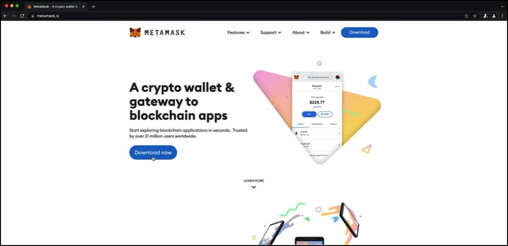

# Práctica 1. Creación de una ID Web3

## Objetivo de la práctica:
Al finalizar la práctica, serás capaz de:
- Experimentar la interacción con un blockchain.
- Crear una ID digital pública.

## Duración aproximada:
- 12 minutos.

## Aviso importante:
El ecosistema blockchain evoluciona rápidamente, con constantes innovaciones y actualizaciones tecnológicas. Durante este programa, trabajaremos con herramientas y recursos externos actuales del mercado para proporcionarte una experiencia práctica y realista.
Aunque nos esforzamos por mantener nuestras guías al día, es posible que encuentres diferencias entre las interfaces mostradas en la documentación y las versiones más recientes de las herramientas. Esto es normal y, en la mayoría de los casos, podrás adaptar fácilmente las instrucciones a la versión actual. Si encuentras dificultades significativas, no dudes en contactar a tu facilitador a través del sistema de mensajería de la plataforma para recibir orientación personalizada.

## Instrucciones 

### Tarea 1. Descargar la extensión MetaMask en su navegador Chrome
Paso 1. Acceder a la página web https://metamask.io desde su navegador. Le recomendamos que utilice Google Chrome en este programa, sobre todo cuando vaya a utilizar estas herramientas. 

Paso 2. Cuando haya accedido a la página web, hacer clic en el botón "Download now" para descargar la extensión.

Paso 3. <!-- Añadir instrucción -->

### Tarea 2. Descripción de la tarea a realizar.
Paso 1. Debe de relatar el instructor en verbo infinito, claro y conciso cada actividad para ir construyendo paso a paso en el objetivo de la tarea.

Paso 2. <!-- Añadir instrucción -->

Paso 3. <!-- Añadir instrucción -->

### Resultado esperado
En esta sección, se debe mostrar el resultado esperado de nuestro laboratorio

