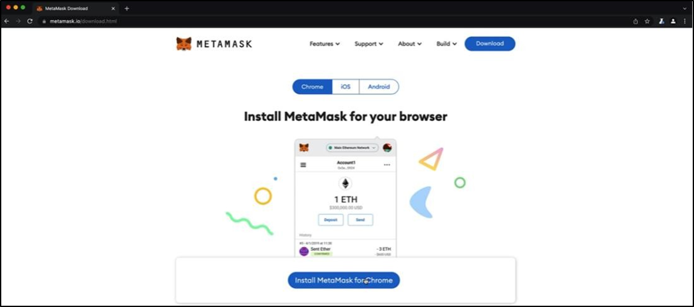
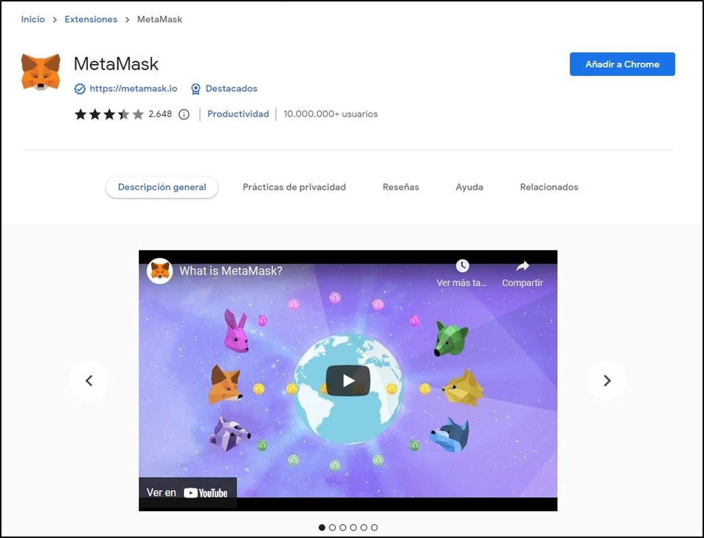
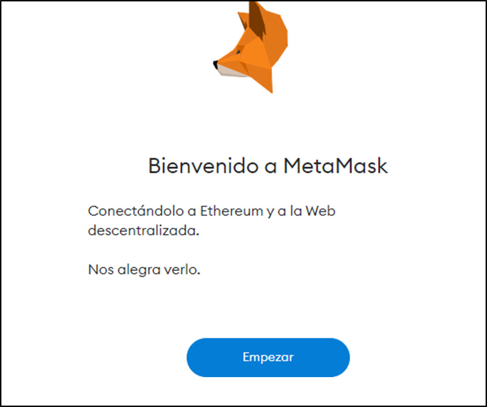
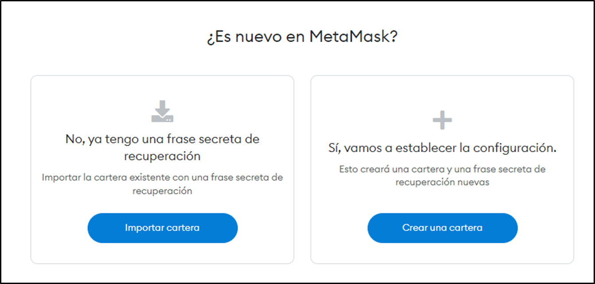
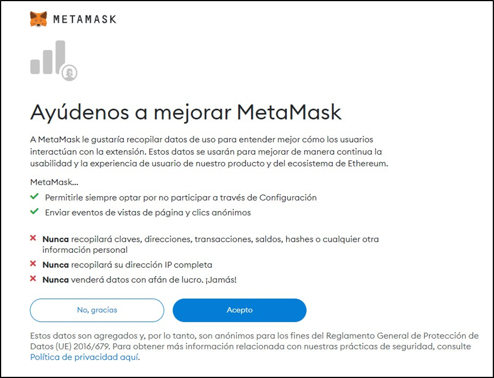
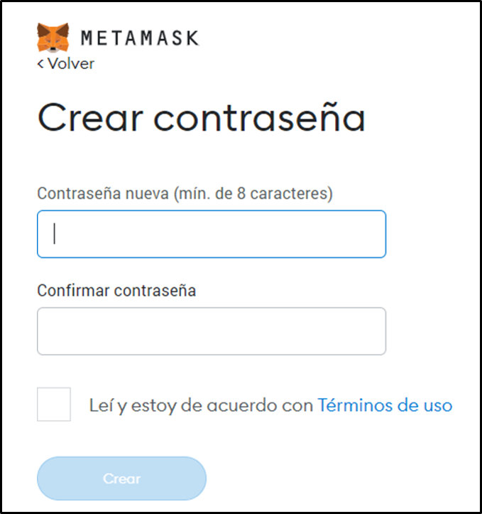
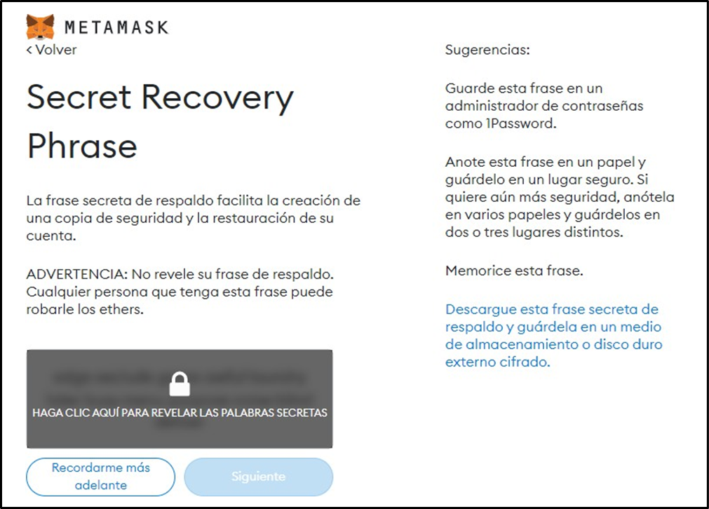
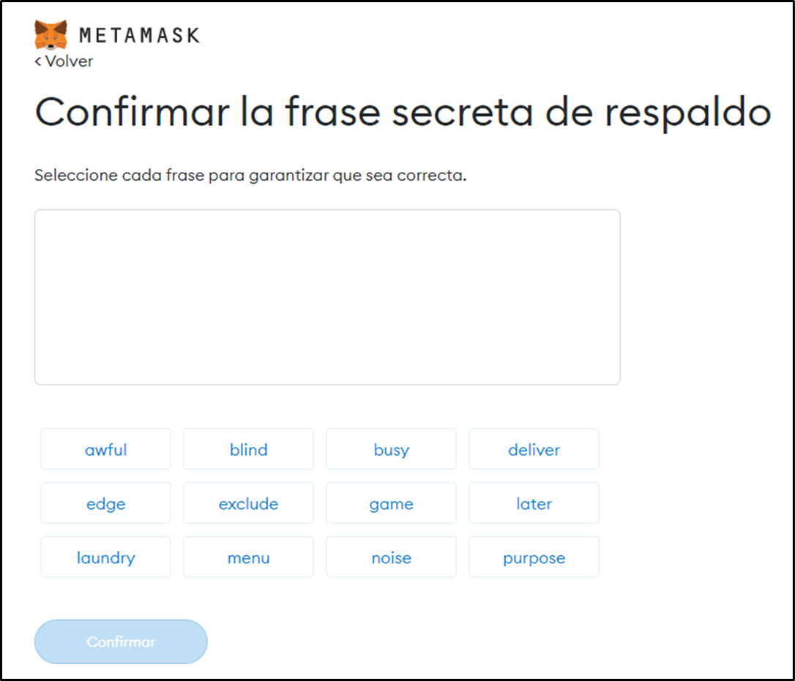
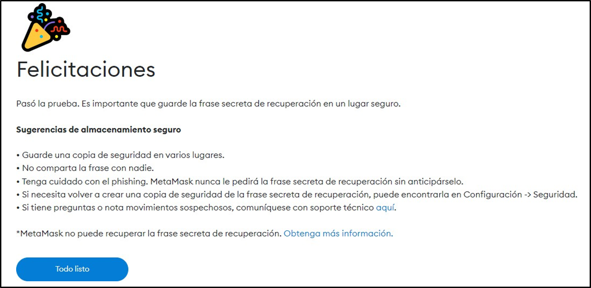

# Práctica 1. Creación de una ID Web3

## Objetivo de la práctica:
Al finalizar la práctica, serás capaz de:
- Experimentar la interacción con un blockchain.
- Crear una ID digital pública.

## Duración aproximada:
- 12 minutos.

## Aviso importante:
El ecosistema blockchain evoluciona rápidamente, con constantes innovaciones y actualizaciones tecnológicas. Durante este programa, trabajaremos con herramientas y recursos externos actuales del mercado para proporcionarte una experiencia práctica y realista.
Aunque nos esforzamos por mantener nuestras guías al día, es posible que encuentres diferencias entre las interfaces mostradas en la documentación y las versiones más recientes de las herramientas. Esto es normal y, en la mayoría de los casos, podrás adaptar fácilmente las instrucciones a la versión actual. Si encuentras dificultades significativas, no dudes en contactar a tu facilitador a través del sistema de mensajería de la plataforma para recibir orientación personalizada.

## Instrucciones 

### Tarea 1. Descargar la extensión MetaMask en su navegador Chrome
Paso 1. Acceder a la página web https://metamask.io desde su navegador. Le recomendamos que utilice Google Chrome en este programa, sobre todo cuando vaya a utilizar estas herramientas. 

Paso 2. Cuando haya accedido a la página web, hacer clic en el botón **Download now** para descargar la extensión.

Paso 3. En la pestaña *Chrome*, seleccionar **Install MetaMask for Chrome** para instalarla.

Esto le llevará a la página de extensiones de Google Chrome. Seleccionar **Añadir a Chrome**.

Cuando se haya instalado en su navegador, se le redireccionará a la página de instalación de MetaMask.

### Tarea 2. Crear una cuenta

Paso 1. Para hacer esta actividad, crearemos una cuenta nueva. Si quiere utilizar una cuenta existente, debe importar su wallet.

Paso 1. Puede elegir si desea participar o no en el sistema de intercambio de información de MetaMask; para ello, seleccione "Acepto" o "No, gracias" respectivamente.

Paso 2. Crear una contraseña.

La frase secreta de respaldo es un componente fundamental del sistema, ya que no existe una entidad central que pueda restablecer la contraseña si la olvida. No la pierda, por favor. 

Paso 3. Hacer clic para acceder a las palabras y guárdelas exactamente en el mismo orden en su dispositivo.

Cuando haga clic en "Siguiente", deberá introducir la frase secreta de respaldo en el orden correspondiente para confirmar que las ha guardado, así también puede importar su wallet a otro dispositivo.

### Resultado esperado
Ya tiene instalada la extensión MetaMask. El siguiente paso es crear algunas cuentas que vamos a utilizar.

