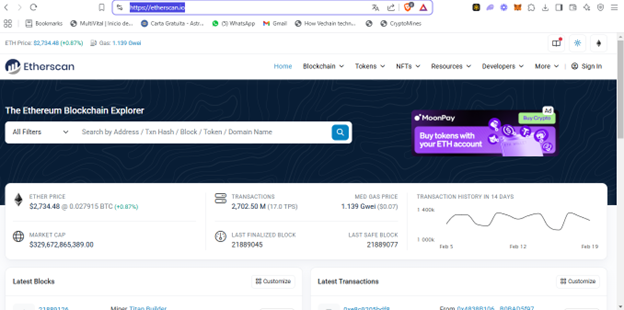
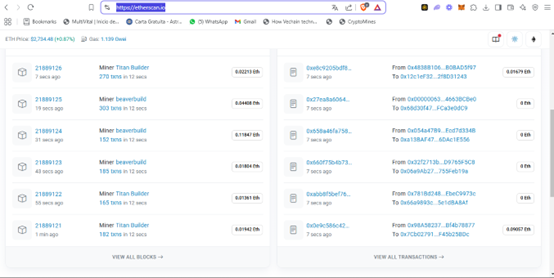
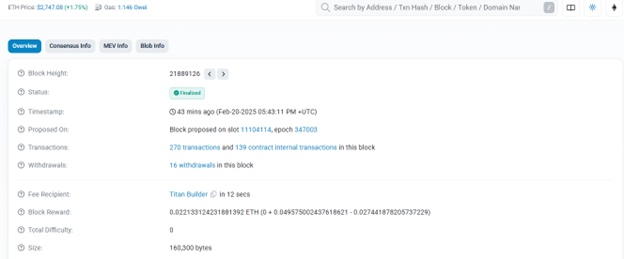
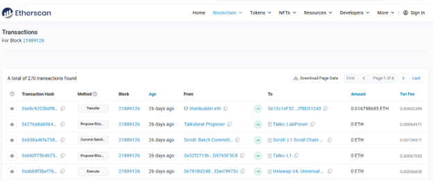
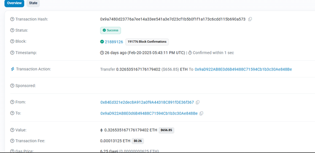

# Práctica 2 Exploración de una blockchain pública

## Objetivo de la práctica:
Al finalizar la práctica, serás capaz de:
- Visualizar el registro de transacciones de una blockchain y la forma de realizar la trazabilidad.
  
## Duración aproximada:
- 6 minutos.

## Instrucciones 

### Tarea 1. Explorar Etherscan
**Paso 1.** Acceder a la página web https://etherscan.io/ desde su navegador. Le recomendamos que utilice Google Chrome en este programa. 

> *Etherscan: Etherscan es una plataforma que permite explorar y analizar la cadena de bloques de Ethereum. Es una de las herramientas más populares para aprender los conceptos básicos de la blockchain.*

**Paso 2.** Deslizarse hacia abajo para poder visualizar las transacciones que se realizan en la blockchain de Ethereum en tiempo real. 
En la parte izquierda podemos visualizar los bloques de transacciones integrados a la cadena de bloques y sus validadores, a la derecha el desglose de las transacciones individuales.

**Paso 3.** Para explorar la parte de los bloques, ingresamos seleccionando el número de bloque.

### Tarea 2. Reconocer los aspectos clave del contenido

**1. Block Height:** Folio que se le asigna al bloque de información añadido a la blockchain. 

**2. Status:** Estado actual del bloque. Normalmente se describe como *finalizado* cuando ya está grabado en la blockchain o *por finalizar* cuando está creado pero aún está en proceso de validación. 

**3. Timestamp:** El momento preciso de la creación del bloque

**4. Proposed on:** Entorno donde interactúan los validadores. Se divide en *slots* (período de tiempo de 12 segundos en el que un validador puede proponer un nuevo bloque) y *epoch* (período de tiempo de 6,4 minutos que contiene 32 espacios) a los que se les designa igual un folio.

**5: Transactions:** Se ejecutan en la blockchain. Contiene las transacciones públicas y las transacciones internas.
*Transacciones públicas*, son las ejectutadas por el contrato inteligente de forma automática.
*Transacciones internas*, es una acción que se lleva a cabo dentro de un contrato inteligente o entre ellos. Se inicia dentro del código, en lugar de hacerlo desde una dirección de billetera.

**6. Withdrawals:** Retiro en la cadena de bloques Ethereum. Es la transferencia de fondos desde la cuenta de un validador a su dirección de retiro. Los retiros pueden ser totales o parciales.

**7. Free Recepient:** Es el nodo validador que recibe la recompensa derivada de las comisiones de la red.

**8. Block Reward:** Monto recibido por el nodo validador.

**9. Dificultad** La dificultad para añadir un nuevo bloque. En este contexto Ethereum paso de ser una red de minería a una red de riesgo por lo que actualmente la dificultad es nula. 

### Tarea 3. Explorar el contenido de las transacciones.

**Paso 1.** Ingresar a transactions para explorar el contenido de las transacciones realizadas en este bloque.

**Paso 2.** Explorar el registro de transacciones de uno de los bloques.
Con esto comprobamos una de las principales características de la información procesada en blockchain, la cual es registrada de forma criptográfica e inmutable, lo que quiere decir que no se puede modificar o eliminar; transparente ya que no se requiere de la autorización de ninguna autoridad para poder explorar el registro; trazable ya que registra fecha y tiempo exacto de la ejecución de la transacción. 

Aquí encontramos el registro de todas las transacciones contenidas en un bloque, el número y tamaño puede variar.  

Las características principales de este registro son: 
- **Transaction hash:** Identificador o hash de transacción, equivalente a un número de folio. 
- **Method:** En programación un método es una acción, en este caso es la acción realizada en la blockchain, como la creación de un token, realizar una transferencia, la creación de los mismos bloques dentro de la cadena, firmas, etc. 
- **Block:** Número del bloque donde se encuentra la transacción.
- **Age:** Temporalidad en la que se realizó la transacción. Se expresa en términos del tiempo transcurrido desde su creación. 
- **From:** Identificador de la dirección que realiza el método. 
- **To:** Identificador de la dirección que recibe el método. 
- **Amount:** Monto en el token nativo de la blockchain que es transferido (en muchas ocasiones su monto es 0 debido a que no es una transacción de valor). 
- **Txn Fee:** Todas las blockchains públicas requieren del pago de una comisión de red para poder funcionar. Este monto varía según la saturación de actividad en la cadena de bloques. 

Paso 3. Para finalizar, vamos a explorar una de las transacciones de transferencia, la cual debido a la naturaleza de las blockchains públicas en su mayoría son transferencias de valor. 

- **Transaction Hash:** Es un identificador único de 66 caracteres (hexadecimal) que funciona como "huella digital" de cada transacción en la blockchain. Se genera aplicando un algoritmo de hash a los datos de la transacción.
- **Status:** Indica el estado actual de la transacción. Los estados comunes son *Succes (exitosa)*, *Failed (fallida)*, *Pending (pendiente)* o *Dropped (descartada)*.
- **Block:** El número del bloque en el que se incluyó la transacción. La blockchain es una cadena de bloques, cada uno con un número secuencial.
- **Timestamp:** La fecha y hora exacta en que la transacción fue incluida en un bloque (confirmada). Se muestra en formato UTC.
- **Transaction Action:** Describe el tipo de operación realizada, como una transferencia simple, una interacción con contrato inteligente, un despliegue de contrato, etc.
- **From:** La dirección (wallet) que inició y firmó la transacción.
- **To:** La dirección de destino que recibe los tokens o con la que se interactúa. Puede ser una wallet personal o un contrato inteligente.
- **Value:** La cantidad de criptomoneda nativa (ETH en Ethereum, BNB en Binance Smart Chain, etc.) transferida en la transacción.
- **Transaction Fee:** El costo total pagado para que la transacción sea procesada en la red. Se calcula como (gas usado × gas price).
- **Gas Price:** El precio por unidad de gas que el remitente está dispuesto a pagar, expresado en la denominación más pequeña de la criptomoneda (Gwei para Ethereum). A mayor gas price, más rápido se procesará la transacción.

